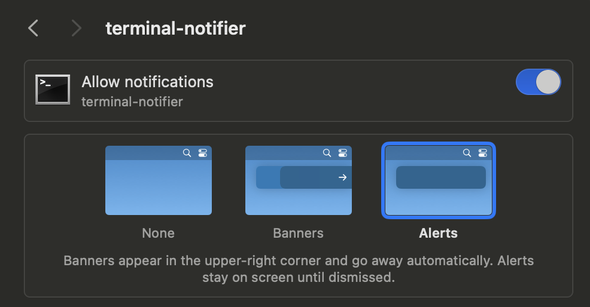

# MeerkatIO - Your Personal Notification Tool

[MeerkatIO](https://meerkatio.com) is the personal notification tool that fits your workflow. This one extension immediately opens the door to any notification method you need to save time in your day, integrating with all of the built in tools already at your fingertips including Jupyter, Terminal, Run+Debug, and VS Code Tasks.

## Available Integrations

- Terminal command monitoring for Mac, Windows, and Linux! MeerkatIO keeps track of all running terminal processes inside of VS Code and alerts you when a process completes according to your workspace settings.
- Jupyter Extension support out of the box. Just run your cell(s) like normal and MeerkatIO will keep an eye out and alert you when your code completes.
- VS Code Run and Debug monitoring. Alert yourself after long-running processes complete from VS Code's built in Run and Debug Tool.
- VS Code Task monitoring. Monitor long running tasks defined in `.vscode/launch.json` without any extra configuration.

## Available Notification Channels

The MeerkatIO VS Code Extension supports the following notification channels:
- Ping (sound)
- System Notification
- Slack
- Microsoft Teams
- Google Chat
- SMS
- Email

## Use Cases

- Ping yourself when your terminal command completes
- Send your phone an SMS text message when your long running Jupyter Notebook cell completes
- Generate a system notification when your test suite completes while you have a different window open
- Slack yourself an update on your build pipeline while you are taking your dog for a walk so you know when to head back

## Quickstart
No setup is required to use the Ping or System commands with this extension, but in order to access Slack, Microsoft Teams, Google Chat, SMS, and Email notification channels a MeerkatIO account is required. [Get started for free today!](https://meerkatio.com/register)

MeerkatIO notifications will automatically (after a window reload) execute for all task, debug, and Jupyter cell executions. The communication channel can be quickly changed and notifications can easily be toggled on and off to fit your current workflow!

## Extension Settings
After creating your account, set the following Extension Settings to unlock the full MeerkatIO Platform command set:

* `meerkat.token`: Your MeerkatIO account token which can be found at https://meerkatio.com/account
* `meerkat.meerkatNotification`: the notification channel you would like to be alerted with. Available notification options:
    * ping
    * system
    * slack
    * teams
    * google_chat
    * email
    * sms
* `meerkat.enabled`: Toggle MeerkatIO notifications on and off
* `meerkat.triggerMinDurationSeconds`: The minimum duration in seconds code must run to cause an alert to be triggered. This avoids noisy alerts on short tasks.

## Tips For Success

- Be sure to configure the `triggerMinDurationSeconds` to match your workflow. Noisy alerts get ignored, so customize this setting to improve your personal workflow.
- Use the MeerkatIO sidebar to easily toggle notifications on and off as you need them

### System Notifications

- On macOS make sure you have notifications enabled for `terminal-notifier` in order to have notifications show up in your system's notification center



- On Linux, make sure you have `notify-osd` or `libnotify-bin` installed. (Installed by default on Ubuntu)

### Remote Development

- MeerkatIO is a workspace extension, meaning all code runs wherever the workspace is hosted. As a result, Ping and System notifications will not function properly on remote development or Docker containers without extra configuration because they are host system notification methods. Below is a workaround solution to use the Ping notification from a Docker dev container:

1. Install Pulseaudio on your local machine
2. Run `pulseaudio --load="module-native-protocol-tcp" --exit-idle-time=-1 --daemon` to start a pulseaudio daemon on your local machine
3. Add Docker runtime arguments to devcontainer.json
```
"runArgs": [
    "-e", "PULSE_SERVER=host.docker.internal"
]
```
4. Add a postCreateCommand to devcontainer.json to install the Pulseaudio tool inside of the Docker container
```
"postCreateCommand": "apt-get install -y pulseaudio"
```

## Telemetry
The MeerkatIO extension collects telemetry data to help build a better VS Code experience. This extension does not send any telemetry from notification trigger sources including commands, paths, files, or personally identifiable information. The extension respects the telemetry.enableTelemetry setting which you can learn more about in the [Visual Studio Code FAQ](https://code.visualstudio.com/docs/supporting/faq#_how-to-disable-telemetry-reporting).

## Release Notes

### 1.8.0

Added Google Chat notifications integration. Improved sign in experience using VS Code authentication sessions with GitHub.

### 1.7.0

Added Microsoft Teams notifications integration

### 1.6.2

Save notification task duration and trigger for future analysis/reporting

### 1.6.1

Fix bug with undefined package in some environments

### 1.6.0

Add re-claimed time stat on side view and improved handling of parallel execution monitors


**Thank you for your support!**
